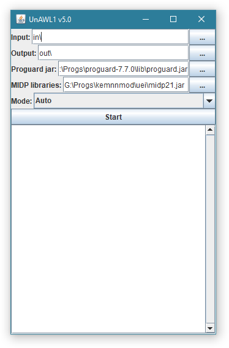

# UnALW1
Tool for removing ad and payment engines from J2ME games

## Currently supports
Payment engines, demo wrappers:
- ALW/ALW1/ALW2
- Freexter
- Glomo
- LM (Aircel)
- Gameloft
- Infon Demotoolkit
- MobileRated (Kalador)
- Mbiz Global

Advertisement engines:
- vServ
- Inneractive
- Hovr
- Greystripe (partially)
- Sensible Mobiles

Misc:
- SMS sending removal
- ASGATech time-bomb
- Game Lobby (M7 Networks) (partially)
